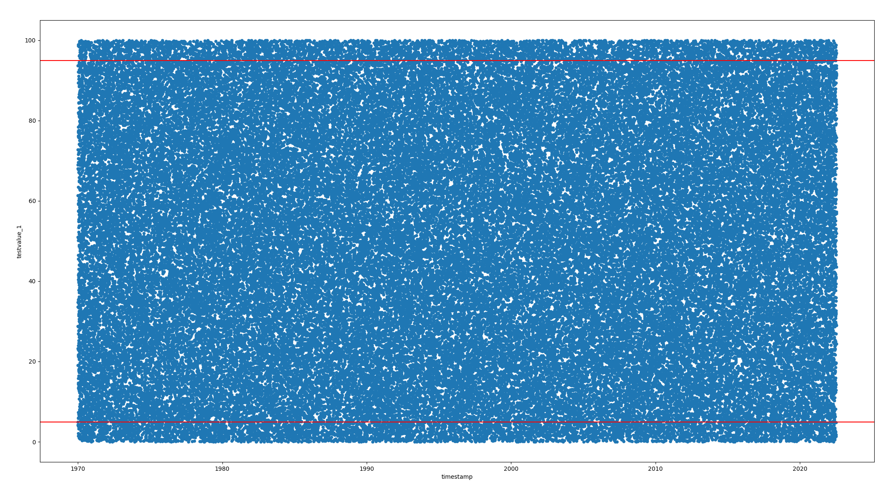

# SIMPLE_QA_DWH

This is a simple proof of concept script to generate test data.

It simulates a QA test at the end of a production run and stores measurements for devices.

We have 3 Tables:

**testdevices:**
A Table with the ID and the name of the device that took the measurement

**qaengineers:**
A Table with the ID and the name of the engineer overseeing the measurement

**tests:**
A Table with the actual tests, it contains 19 measurements in double precision and the id of the test device, a timestamp, a serialnumber and the id of the engineer.

## How To use:

- Prepare a Postgres Database and user, and add its connection to the `config.py`
- adjust the numbers of test you want in `config.py`
- install dependencies from `requirements.txt`
- run `create_testdata.py`  **THIS WILL DELETE EXISTING DATA**

## visualize.py

This script will create a scatterplot from `testvalue_1` over time with the 95% and 5% percentile drawn in.

Since the generated test data is random and evenly distributed, it does not really provide any good information and should only be used as a proof of concept.

